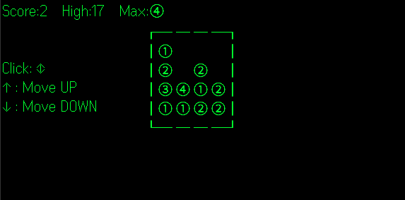

# Make20

[Even Realities G2](https://www.evenrealities.com/) スマートグラス向けの2048風パズルゲーム。

4x4の盤面で同じ数字を合体させて、より大きな数字を作ろう。目標は ⑳ (20) に到達すること。

## 遊ぶ

Even G2でQRコードを読み取ってプレイ:


https://takashicompany.github.io/make20/

## スクリーンショット



## 仕組み

オリジナルの2048（倍増: 2→4→8→...）と異なり、Make20は連番（①→②→③→...）を使用。同じタイルを2つ合体させると次の数字になる（例: ③+③=④）。

盤面はG2のテキストコンテナシステムに対応するため、全てUnicode文字（丸数字 ①-⑳）で描画される。

```
┌──────────┐
│① ② 　 ④│
│　 ③ ① 　│
│② 　 ⑤ ①│
│　 ④ 　 ②│
└──────────┘
```

## 操作方法

| 入力 | アクション |
|------|-----------|
| スクロール上下 | タイルを移動 |
| タップ | 移動方向の切り替え（↕ 縦 ↔ 横） |

現在の移動方向はヘッダーに表示される。スクロールで選択中の軸に沿ってタイルが移動する。

## 特徴

- ピクセル単位のスムーズなタイルスライドアニメーション
- スコア記録とハイスコアの保持
- 自動セーブと再接続時の復帰
- ゲームオーバー判定

## 開発

### 必要なもの

- [Node.js](https://nodejs.org/) (v20+)
- Even Realities G2 グラス（または [evenhub-simulator](https://www.npmjs.com/package/@evenrealities/evenhub-simulator)）

### 開発サーバー

```bash
npm install
npm run dev
```

### グラスとの接続

```bash
npm run qr
```

表示されたQRコードをEven G2で読み取って接続。

### ビルド・パッケージ

```bash
npm run build
npm run pack
```

## プロジェクト構成

```
├── g2/
│   ├── index.ts        # アプリモジュール定義
│   ├── main.ts         # ブリッジ接続とエントリポイント
│   ├── app.ts          # ゲームライフサイクルとイベントハンドラ
│   ├── game.ts         # ゲームコアロジック（スライド・合体・ゲームオーバー）
│   ├── board-text.ts   # Unicode文字レンダリング（①-⑳、枠線）
│   ├── renderer.ts     # Even Hub SDK コンテナ管理
│   ├── state.ts        # ゲーム状態とlocalStorage永続化
│   ├── layout.ts       # 表示定数とアニメーションパラメータ
│   ├── events.ts       # イベント処理
│   └── animation.ts    # アニメーションユーティリティ
├── _shared/
│   ├── app-types.ts    # 共有型定義
│   └── log.ts          # ログユーティリティ
├── index.html          # エントリポイント
├── app.json            # Even Hub アプリマニフェスト
├── vite.config.ts      # Vite設定
└── package.json
```

## 技術スタック

- [TypeScript](https://www.typescriptlang.org/)
- [Vite](https://vitejs.dev/)
- [Even Hub SDK](https://www.npmjs.com/package/@evenrealities/even_hub_sdk) (`@evenrealities/even_hub_sdk`)

## アーキテクチャ

ゲームは4つのテキストコンテナ（G2の上限）を使用:

| コンテナ | ID | 用途 |
|---------|-----|------|
| evt | 1 | 不可視のイベントキャプチャ（全画面） |
| header | 2 | スコア、ハイスコア、最大タイル、操作ガイド |
| static | 3 | 枠線と静止タイルの盤面 |
| moving | 4 | アニメーション中のタイル（ピクセルオフセットで移動） |

スライドアニメーション中、`moving` コンテナはピクセルオフセット（`xPosition` / `yPosition`）で移動し、テキストを毎フレーム再構築せずにスムーズなタイル移動を実現している。
